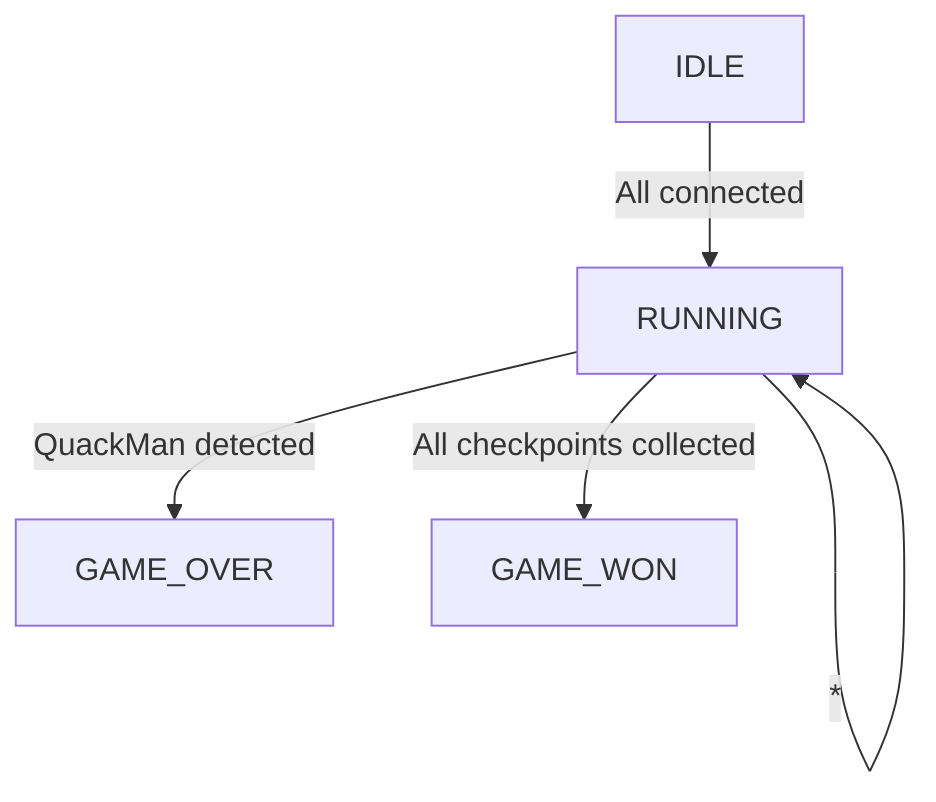

# game_master

The game master informs all bots about the current game state.
The game has 3 states:
- `IDLE`: The game is not running, waiting for bots to join.
- `RUNNING`: The game is running, bots can send status updates, QuackMan can send the current score.
- `GAME_OVER`: QuackMan has been caught by a bot.
- `GAME_WON`: QuackMan has collected all checkpoints and won the game.

The game master is implemented as a state machine.



## Communication
All messages are sent as JSON objects.
Every message has a `type` field to determine the message type.

The bots can connect with WebSockets to the game master and send status updates.
The game master will send the current game state to all connected bots in an interval of `100ms`.
The message is a JSON object:
```json
{
  "type": "GAME_STATE",
  "data": {
    "state": "IDLE"
  }
}
```

There are two types of bots, every message send by a bot must have a `bot` field to identify the bot by its name.
## QuackMan
QuackMan must connect to `ws://localhost:8080/quackman`.
QuackMan can send the current score to the game master as a JSON object:
```json
{
  "bot": "APRICOT",
  "type": "SCORE",
  "data": {
    "score": 42
  }
}
```
The QuackMan can also inform the game master when it collected all checkpoints:
```json
{
  "bot": "APRICOT",
  "type": "CHECKPOINT",
  "data": {
    "allCollected": true
  }
}
```
If the QuackMan doesn't collect a new checkpoint within the deadline, he can inform the game master that therefor the game is lost.
```json
{
  "bot": "APRICOT",
  "type": "TIMEOUT",
  "data": {
    "checkpointTimeout": true
  }
}
```

## GhostBot
GhostBot must connect to `ws://localhost:8080/ghostbot`.
GhostBots can inform the game master when they detected QuackMan:
```json
{
  "bot": "EDWARD",
  "type": "DETECTION",
  "data": {
    "detected": true
  }
}
```